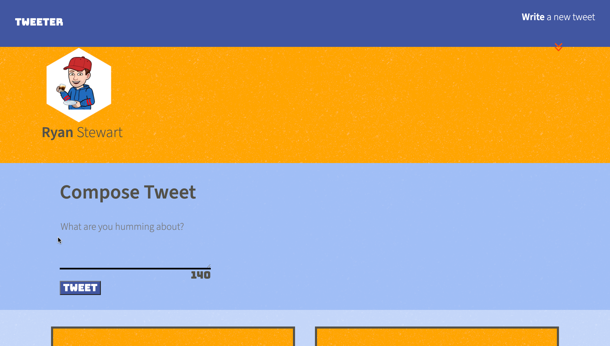

# Tweeter Project

Tweeter is a simple, single-page Twitter clone.

This app was bulit with HTML, CSS, JS, jQuery and AJAX for the front-end, and Node, Express for the back-end.

## Core Features

- Start by writing a tweet in the tweet box and clicking tweet to submit it.
- Your tweet will be added on the page with the other tweets without the page refreshing.
- Error messages will be displayed if your tweet is empty or if your tweet exceeds character limit.
- This app uses responsive design and will adjust depending on the display size.

## Screenshots

## Getting Started

1. Install dependencies using the `npm install` command.
2. Start the web server using the `npm run local` command. The app will be served at <http://localhost:8000/>.
3. Go to <http://localhost:8000/> in your browser.

## Dependencies

- Express
- Node 5.10.x or above
- Nodemon
